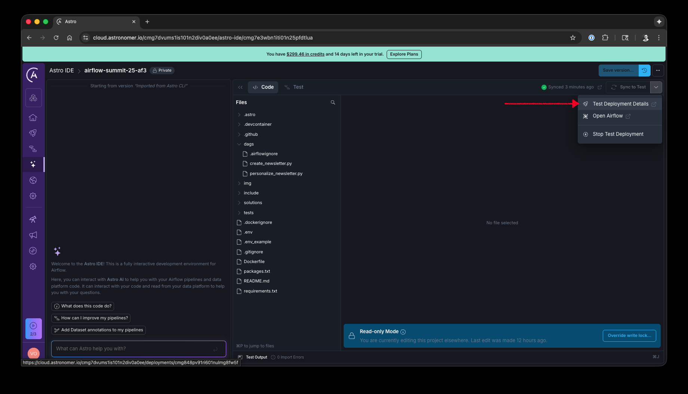
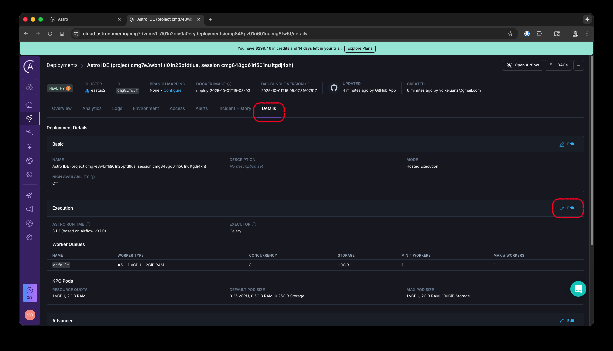
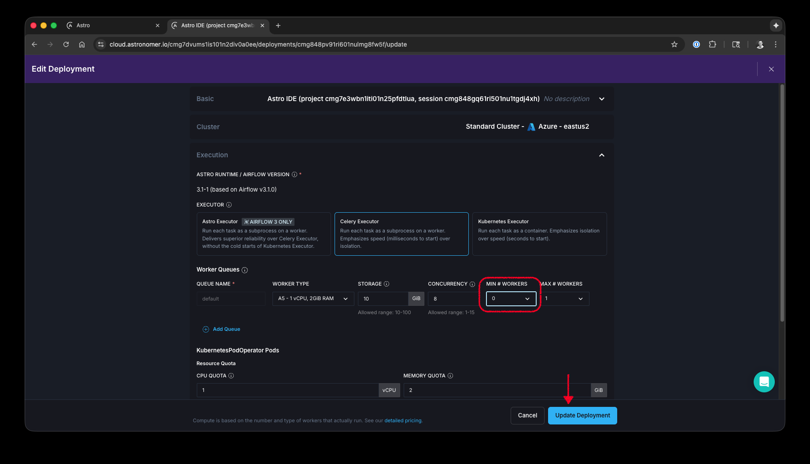
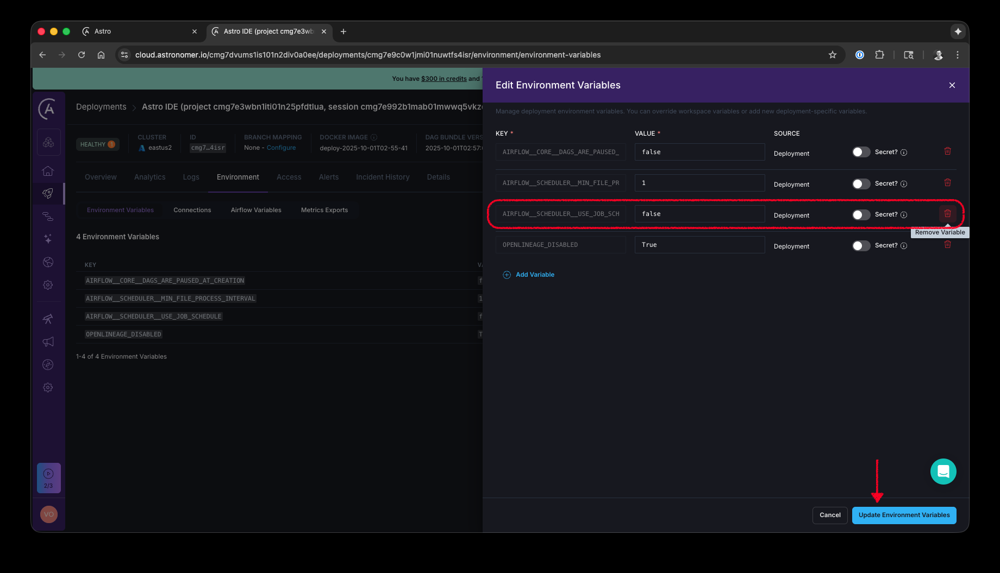

# Productionising dbt Core with Airflow

Welcome! 🚀

This is the repository for Astronomer's [Productionising dbt Core with Airflow workshop](https://airflowsummit.org/sessions/2025/productionising-dbt-core/) given at Airflow Summit 2025. The 2.5 hour workshop is designed to get you familiar with some of the main features in [Astronomer Cosmos](https://github.com/astronomer/astronomer-cosmos).

The worksho slides can be found [here](https://docs.google.com/presentation/d/1QlOrxCoPUtmrBceY_yZAyhAEg7qZVUd__wzje1gNnKw/edit?slide=id.g3878061f0be_0_170#slide=id.g3878061f0be_0_170).

# Goal

The aim with this workshop is to allow all the attendees of the workshop to run a dbt project in Airflow using different strategies. These are some of the topics we plan to cover:

* Getting started with Cosmos
   - Running dbt in Airflow
   - Troubleshooting
* Managing database credentials
   - From connections to profiles
* Configuring how to run dbt
   - Managing dependency conflicts
   - What are execution modes and how to use them
   - Customising arguments per model
* Changing how the DAG looks like
   - Selectors
   - Source and test nodes
* dbt Docs
* Running at scale
   - Addressing performance challenges
   - Leveraging deferrable operators

# How to use this repo

Set up your environment by following the instructions in the [Setup](#setup) section below. All DAGs in this repository can be run locally and on Astro. Given that dbt relies on running transformations on database, we are setting temporary credentials to BigQuery. These credentials will no longer work after the workshop.

Sample solutions for DAG-writing related exercises can be found in the [`solutions/`](/solutions/) folder of the repo, note that some exercises can be solved in multiple ways.

During the workshop, we strongly recommend attendees to use the recently published eBook [Orchestrating dbt with Airflow using Cosmos](https://www.astronomer.io/ebook/orchestrating-dbt-with-airflow-using-cosmos/). You can find more examples of how to use Cosmos in the [eBook companion repository](https://github.com/astronomer/cosmos-ebook-companion).

# Setup

For this workshop, you will use a free trial of Astro to run Airflow and the Astro IDE to write DAGs. It is not necessary to understand all details of the Astro platform, but in a nutshell: Each customer has a dedicated Organization on Astro. One Organization can have multiple Workspaces (e.g. per team). A Workspace is a collection of Deployments. Each Workspace can have multiple Deployments. A Deployment is an Airflow environment hosted on Astro.

## Setting up Astro

1. Create a free trial of Astro [using this link](https://www.astronomer.io/lp/signup/afsummit/?utm_campaign=event-airflow-summit-10-25[…]munity&utm_source=comm-evt-gen&utm_content=dbt-core-workshop).
   - After creating an account and logging in, choose `Start a Free Astro Trial` (click link Create Organization)
   - When being asked how you want to use Astro, choose Personal
   - Choose an Organization name and a Workspace name
   - When asked to select a template, click `None`. Leave all other settings and click `Create Deployment in Astro`. Note that you will not need this Deployment for this workshop, but you can use it for the remaining duration of your trial.
   - You should now see the UI of the Astro platform. Leave it for now, we'll come back to it in a few steps.
2. Install the free [Astro CLI](https://www.astronomer.io/docs/astro/cli/install-cli).
3. [Fork this repository](https://github.com/astronomer/devrel-public-workshops/fork). Make sure you uncheck the `Copy the main branch only` option when forking.

   
4. Clone your fork. Get the URL by clicking on Code -> Copy to clipboard. Then run `git clone <url>`.
5. Run `git checkout dbt-in-airflow` to switch to the airflow 3 branch.
6. Ensure you are authenticated to your Astro trial by running `astro login` in your terminal. It will prompt you to go to your browser to sign in.
7. Export your project to the Astro IDE by running `astro ide project export` in your terminal. Choose `y` to create a new project, and give your project a name when prompted. Your new Astro IDE project should automatically open in a browser.
8. To start Airflow, click the `Start test deployment` button. This will create a small Airflow Deployment for you to run your dags. It may take a few minutes to spin up.
9. To enable scheduled dag runs in your new Airflow Deployment, click on the drop down next to `Sync to test`, and click `Test Deployment Details`.

   

In the Deployment, you need to perform 2 changes:

   - Update the minimum workers by going to the `Details` tab, then `Execution` and click `Edit`.
   

   Set `Min # Workers` to 0, and click `Update Deployment`.
   

   - Go to the `Environment` tab, click `Edit Deployment Variables`, and delete the `AIRFLOW__SCHEDULER__USE_JOB_SCHEDULE` variable.

   

10. Go back to the Astro IDE, and in the drop down next to `Sync to Test`, click on `Open Airflow`.

# Overview about exercises

## dbt Projects

The exercises in this repo use two dbt projects:

1. [Jaffle Shop](https://github.com/dbt-labs/jaffle-shop)

2. [FHIR dbt analytics](https://github.com/google/fhir-dbt-analytics)

While we encourage you to modify and use your own dbt projects with Cosmos, we will focus on running examples and supporting users using these two projects.

## Methodology

Each exercise will have three stages:

a) Introduction to the topic (~3 minutes)
b) Hand's on exercise (~12 minutes)
c) Solution review (~5 minutes)

If you don't finish the exercise, don't worry, you can still do the next exercise.

If you finish the exercise quickly, you have two options:
1. Offer help to another attendee
2. Do the the bonus exercises

# Exercises

## Exercise 1: Getting started with Cosmos

### Goal

Understand the difference between using a BashOperator and Cosmos to run a dbt project.

### Context

You are given an Airflow repo that has a DAG that runs a dbt Core pipeline using BashOperator.

### Tasks

a) Run the given `BashOperator` DAG and see it working.
b) Create a new DAG to run the dbt project with a Cosmos `DbtDag` instead