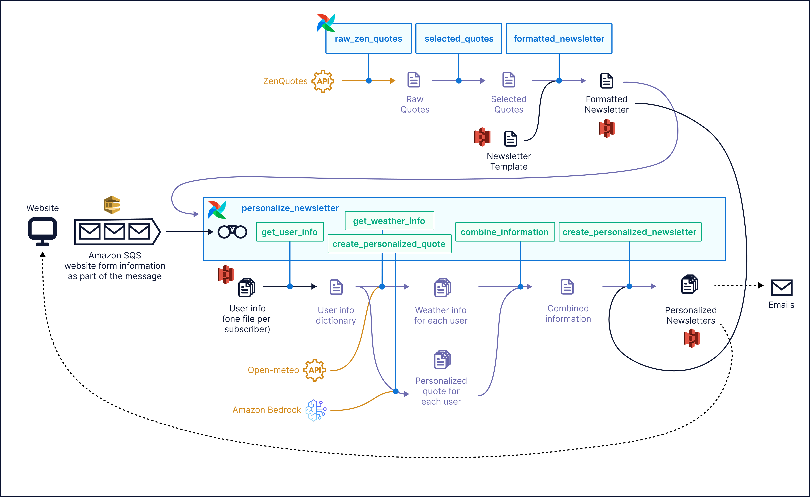

# Airflow 3 Workshop

Welcome! 🚀

This is the repository for Astronomer's Discover Airflow 3 hands-on workshop. The workshop is designed to get you familiar with some of the biggest new features in Airflow 3.0.


## How to use this repo

Set up your environment by following the instructions in the [Setup](#setup) section below. All DAGs in this repository can be run locally and on Astro without connecting to external systems. The exercises are designed to get you exposure to new features in Airflow 3. There are also optional exercises that require an AWS account.

Sample solutions for DAG-writing related exercises can be found in the [`dags/solutions`](/solutions/) folder of the repo, note that some exercises can be solved in multiple ways.

> [!TIP]
> Consider using [Ask Astro](ask.astronomer.io) if you need additional guidance with any of the exercises.

For additional Airflow 3.0 examples, see [our repo](https://github.com/astronomer/airflow-3-demos).

### Setup

To set up a local Airflow environment you have two options, you can either use the Astro CLI or GitHub Codespaces.

#### Option 1: Astro CLI

1. Make sure you have [Docker](https://docs.docker.com/get-docker/) or Podman installed and running on your machine.
2. Install the free [Astro CLI](https://www.astronomer.io/docs/astro/cli/install-cli).
3. Fork this repository and clone it to your local machine. Make sure you uncheck the `Copy the main branch only` option when forking.

   

4. Clone the repository and run `git checkout airflow-3-0` to switch to the airflow 3 branch
5. Run `astro dev start` in the root of the cloned repository to start the Airflow environment.
6. Access the Airflow UI at `localhost:8080` in your browser. Log in using `admin` as both the username and password.

#### Option 2: GitHub Codespaces

If you can't install the CLI, you can run the project from your forked repo using GitHub Codespaces.

1. Fork this repository. Make sure you uncheck the `Copy the main branch only` option when forking.

   

2. Make sure you are on the `airflow-3-0` branch.
3. Click on the green "Code" button and select the "Codespaces" tab. 
4. Click on the 3 dots and then `+ New with options...` to create a new Codespace with a configuration, make sure to select a Machine type of at least `4-core`.

   

5. Run `astro dev start -n --wait 5m` in the Codespaces terminal to start the Airflow environment using the Astro CLI. This can take a few minutes.

   

   Once you see the following printed to your terminal, the Airflow environment is ready to use:

   ```text
   ✔ Project image has been updated
   ✔ Project started
   ➤ Airflow UI: http://localhost:8080
   ➤ Postgres Database: postgresql://localhost:5435/postgres
   ➤ The default Postgres DB credentials are: postgres:postgres
   ```

6. Once the Airflow project has started, access the Airflow UI by clicking on the Ports tab and opening the forward URL for port `8080`.

> [!TIP]
> If when accessing the forward URL you get an error like `{"detail":"Invalid or unsafe next URL"}`, you will need to modify the forwarded URL. Delete everything forward of `next=....` (this should be after `/login?`, ). The URL will update, adn then remove `:8080`, so your URL should endd in `.app.github.dev`

7. Log into the Airflow UI using `admin` as both the username and password. It is possible that after logging in you see an error, in this case you have to open the URL again from the ports tab.

# Exercises

The use case for this workshop is using Airflow to create an automated personalized newsletter. There is an ETL pipeline for retrieving the data, formatting it, and creating the newsletter template. Then there is another pipeline that personalizes the newsletter based on user input. The personalization pipeline is simplified to not require access to external systems - but there is a more complex GenAI version (used in the optional Exercise 5) that shows inference execution with event-driven scheduling and LLM-driven personalization. This exercise requires an AWS account with access to SQS and Bedrock to complete.



Exercises in this workshop require updating the DAGs in the `dags/` folder of this repo, and focus on newly added features in Airflow 3.0. For more background on these features, use the following resources:

- [An Introduction to the Airflow UI](https://www.astronomer.io/docs/learn/airflow-ui/)
- [Assets and Data-Aware Scheduling in Airflow](https://www.astronomer.io/docs/learn/airflow-datasets/)
- [DAG Versioning and DAG Bundles](https://www.astronomer.io/docs/learn/airflow-dag-versioning/)
- [Rerun Airflow DAGs and Tasks](https://www.astronomer.io/docs/learn/rerunning-dags/)
- [Event-Driven Scheduling](https://www.astronomer.io/docs/learn/airflow-event-driven-scheduling/)


## Exercise 1: Explore the new UI

Airflow 3 has a completely refreshed UI that is React-based and easier to navigate. Once you have started Airflow, explore the new UI to develop your workflow.

1. Review the new Home page. There won't be much here to start, but you'll change that momentarily!
2. Explore the Dags and Assets tabs. See if you can get an understanding of the relationship between the DAGs in the environment so far. What dependencies currently exist?
3. Unpause the `raw_zen_quotes` and `selected_quotes` DAGs. Run the `raw_zen_quotes` DAG, either by triggering the DAG, or creating an asset event. Is there a difference between the two methods?
4. Note what happens after `raw_zen_quotes` has run. Do any other DAGs run?
5. Try unpausing the `personalize_newsletter` DAG. It should run automatically once, but it will fail. The failure is expected, and you will fix it in the next exercise. The Airflow 3 UI makes it easier to navigate to task logs. See if you can figure out what went wrong with `personalize_newsletter`.
6. Switch to dark mode 😎


## Exercise 2: Use Assets

In the previous exercise, you explored the UI and saw that in your current Airflow environment, you have three DAGs, and three assets (`raw_zen_quotes`, `selected_quotes`, and `personalized_newsletters`). Conceptually, assets are the next evolution of Airflow datasets: they represent a collection of logically related data. You can have asset-oriented DAGs (`raw_zen_quotes`, `selected_quotes`), or task-oriented DAGs (`personalize_newsletter`). Every asset you define will create one DAG, but tasks can still produce assets and task-oriented DAGs can be scheduled on asset updates.

In this repo, `raw_zen_quotes` and `selected_quotes` are part of an asset-oriented ETL pipeline that create the general newsletter template by retrieving data from an API, formatting the data, and bringing the data together in the template. You'll notice that the "load" step to bring the template together is missing. Let's fix that.

1. Create a new asset in `create_newsletter.py` called `formatted_newsletter`. Use the following Python code as the _body_ of the asset:
   ```python
   """
   Formats the newsletter.
   """
   from airflow.io.path import ObjectStoragePath

   object_storage_path = ObjectStoragePath(
      f"{OBJECT_STORAGE_SYSTEM}://{OBJECT_STORAGE_PATH_NEWSLETTER}",
      conn_id=OBJECT_STORAGE_CONN_ID,
   )

   selected_quotes = context["ti"].xcom_pull(
        dag_id="selected_quotes",
        task_ids=["selected_quotes"],
        key="return_value",
        include_prior_dates=True,
    )[0]

   # fetch the run date of the pipeline
   run_date = context["triggering_asset_events"][Asset("selected_quotes")][0].extra[
      "run_date"
   ]

   newsletter_template_path = object_storage_path / "newsletter_template.txt"

   newsletter_template = newsletter_template_path.read_text()

   newsletter = newsletter_template.format(
      quote_text_1=selected_quotes["short_q"]["q"],
      quote_author_1=selected_quotes["short_q"]["a"],
      quote_text_2=selected_quotes["median_q"]["q"],
      quote_author_2=selected_quotes["median_q"]["a"],
      quote_text_3=selected_quotes["long_q"]["q"],
      quote_author_3=selected_quotes["long_q"]["a"],
      date=run_date,
   )

   date_newsletter_path = object_storage_path / f"{run_date}_newsletter.txt"

   date_newsletter_path.write_text(newsletter)

   # attach the run date to the asset event
   yield Metadata(Asset("formatted_newsletter"), {"run_date": run_date})
   ```

2. Give the asset a schedule. It should run when the `selected_quotes` asset is available.
3. After you have saved the file, check out your new asset graph in the Airflow UI. You should see your full ETL pipeline with three DAGs and three assets.
4. Now that your ETL pipeline is complete, take a look at the `personalize_newsletter` DAG. This DAG is currently set to run daily, but it will actually fail if the `formatted_newsletter` asset has not been updated. Change the schedule of `personalize_newsletter` so that it actually runs only when the right data is available.
5. This pipeline will generate a newsletter with motivational quotes and personalized weather information. In the `include/user_data` folder, update `user_100.json` to include your own name and location.
   - Bonus: try adding additional user files in `include/user_data` and see how that changes the pipeline when it runs.
6. Run your full pipeline by materializing the `raw_zen_quotes` DAG. This should trigger all downstream assets and tasks to complete. Check that everything worked by reviewing the DAG runs in the Airflow UI, and checking your local `include/newsletter` folder for your personalized newsletter.

> [!TIP]
> The open-meteo weather API is occasionally flaky. If you get a failure in your `get_weather_info` task, let it retry, it will usually resolve. If you added additional users, you may need to implement a pool so you don't hit API rate limits. Ask one of your workshop leaders for help with this.

## Exercise 3: Run a Backfill

For ETL pipelines that are time-dependent, like this one in this example, you may occasionally need to reprocess historical data. Backfills are a first-class feature in Airflow 3, and make this easy.

Let's say you just deployed these pipelines, and you need to create newsletters for the past couple of days.

1. Start a backfill of the `raw_zen_quotes` DAG using the UI, by clicking the blue `Trigger` button and selecting `Backfill`. (see: [Backfill](https://www.astronomer.io/docs/learn/rerunning-dags#backfill))
2. In the `Backfill` form, choose a date range and reprocessing behavior that triggers 2 runs.
3. Start the backfill, and notice the progress bar in the UI (you may need to refresh the page). What is different about these runs in the grid?
4. Notice what happened to the other downstream DAGs in your environment. Were they triggered as well?

## Exercise 4: Use DAG versioning

DAG versioning is a new feature in Airflow 3 that allows you to track changes to your DAG code over time in the Airflow UI. DAG versioning using the `LocalDagBundle` is set up automatically.

Changes to your DAG's structure will prompt a new version to be recorded by Airflow. In Exercise 2, you made a change to the `personalize_newsletter` DAG - let's start there.

1. In the Airflow UI, go to the Graph of your `personalize_newsletter` DAG, click on `Options` and notice the Dag Version drop down. How many versions are there?
2. The change to the schedule doesn't actually change the graph of the DAG, but you can see the change from the code. Look at the `Code` tab for your DAG, and try toggling between the two versions.
3. Let's make another change. Go to the code for your `personalize_newsletter` DAG and add a task using the `@task` decorator that does anything (some simple math will work for this purpose). Go back to the UI and rerun the DAG - was a new DAG version created?

> [!TIP]
> New DAG versions are only created when the DAG's structure changes. Making a change to the task code will not prompt a new version.

## (Optional) Exercise 5: Deploy to Astro

Now that you have working pipelines that create an awesome personalized newsletter, a great next step is deploying to production! (hopefully you aren't running real pipelines on your local computer!)

Astro has full support for Airflow 3, as well as additional features that make running your pipelines in production easier and more scalable.

To try out this example on Astro:

1. Create a free Astro trial by signing up [here](https://www.astronomer.io/lp/signup/)
2. [Create a Deployment](https://www.astronomer.io/docs/astro/create-deployment).
3. [Deploy your project](https://www.astronomer.io/docs/astro/deploy-code) using the Astro CLI.


## (Future work) Exercise 6: Run a GenAI DAG with event-driven scheduling

The `personalize_newsletter` pipeline in this workshop is designed to not require connections to any external systems. While this is helpful for workshop participants who may not all use the same tech stack, it is not representative of real-world Airflow usage.

To demonstrate a more realistic version of this pipeline, we have also included a version that personalizes the newsletter quotes by sending user input to an LLM through Amazon Bedrock, and runs when a message arrives in SQS. This simulates event-driven scheduling, that you might expect if you offered an on-demand newsletter to customers - so your pipeline runs as soon as users input their information.

You can run this version of the pipeline yourself if you have access to an AWS account:

1. Replace the contents of `dags/personalize_newsletter.py` with the code in `solutions/personalize_newsletter_genai.py` (this will create a new DAG version!). 
2. Add the contents of `.env_example` to `.env`, making sure to update `AIRFLOW_CONN_AWS_DEFAULT` with the credentials for your AWS account. If you do this, MAKE SURE to add the `.env` file to `.gitignore` so you do not push your credentials to GitHub.
3. Create a new SQS queue, and add the URL to `SQS_QUEUE_URL` in your `.env` file.
4. Restart your Airflow project with `astro dev restart` for the `.env` changes to take effect.
5. Run the new `personalize_newsletter` DAG by adding a message to your SQS queue with the following format:
   ```
   {
    "id": 300,
    "name": "Kenten",
    "location": "Seattle",
    "motivation": "Finding my way.",
    "favorite_sci_fi_character": "Spock (Star Trek)"
   }
   ```
6. Check to see that your `personalize_newsletter` DAG started running. Note that you can change the Bedrock model used by the DAG, and you may need to request access to a particular model from within your AWS account if you have not already used it.
7. Review your personalized newsletter in `include/newsletters`.

