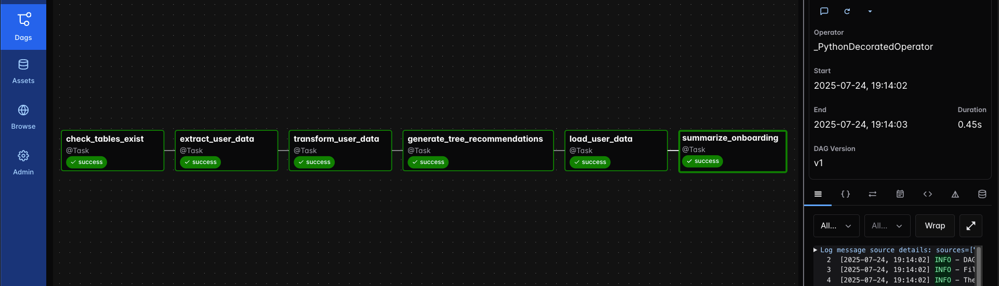

# Intro to Airflow and Astro Workshop

Welcome! 🚀

This is the repository for Astronomer's Intro to Airflow and Astro hands-on workshop. The workshop is designed to help you become familiar with how to write basic data pipelines with Apache Airflow, and how to deploy them to run in production on Astro.

In this example use case you are a data engineer at the start up **ReLeaf** which offers hyper-local and personalized recommendations for the ideal tree to plant to its customers. From individuals looking to get some nice lasting shade in their backyard to large cooperations adding relaxation and relief to store locations to attract more customers to government entities planning whole-city reforestation - ReLeaf knows which trees will thrive for any location! 🌲🌳🌴  

## How to use this repo

Set up your environment by following the instructions in the [Setup](#setup) section below. Most DAGs in this repository can be run locally and on Astro without connecting to external systems.

Optionally, if you'd like to run the `genai_releaf` DAG, you will need to provide your `OPENAI_API_KEY` in a `.env` file at the root of the repository.

Sample solutions for DAG-writing related exercises can be found in the [`solutions/`](/solutions/) folder of the repo, note that some exercises can be solved in multiple ways.

> [!TIP]
> Consider using [Ask Astro](https://ask.astronomer.io/) if you need additional guidance with any of the exercises.

### Setup

To set up a local Airflow environment you have two options, you can either use the Astro CLI or GitHub Codespaces.

#### Option 1: Astro CLI

1. Make sure you have [Docker](https://docs.docker.com/get-docker/) or Podman installed and running on your machine.
2. Install the free [Astro CLI](https://www.astronomer.io/docs/astro/cli/install-cli).
3. [Fork](https://docs.github.com/en/pull-requests/collaborating-with-pull-requests/working-with-forks/fork-a-repo) this repository and [clone](https://docs.github.com/en/repositories/creating-and-managing-repositories/cloning-a-repository) it to your local machine. Make sure you uncheck the `Copy the main branch only` option when forking as shown in the screenshot below.

   

4. Clone the repository and run `git checkout intro-to-airflow-astro` to switch to the correct workshop branch.
5. (Optional). If you want to be able to run the `genai_releaf` DAG that uses OpenAI to generate a message, you need to provide your own `OPENAI_API_KEY`. Add a file called `.env` in the root of your repository and enter `OPENAI_API_KEY="<your OpenAI API KEY>"`.
6. Run `astro dev start` in the root of the cloned repository to start the Airflow environment.
7. Access the Airflow UI at `localhost:8080` in your browser.
8. Run the `releaf_database_setup` DAG to create your database and populate it with sample data.

#### Option 2: GitHub Codespaces

If you can't install the CLI, you can run the project from your forked repo using GitHub Codespaces.

1. Fork this repository. Make sure you uncheck the `Copy the main branch only` option when forking.

   

2. Make sure you are on the `intro-to-airflow-astro` branch.
3. Click on the green "Code" button and select the "Codespaces" tab. 
4. Click on the 3 dots and then `+ New with options...` to create a new Codespace with a configuration, make sure to select a Machine type of at least `4-core`.

   

5. (Optional). If you want to be able to run the `genai_releaf` DAG that uses OpenAI to generate a message, you need to provide your own `OPENAI_API_KEY`. Add a file called `.env` in the root of your repository and enter `OPENAI_API_KEY="<your OpenAI API KEY>"`.

6. Run `astro dev start -n --wait 5m` in the Codespaces terminal to start the Airflow environment using the Astro CLI. This can take a few minutes.

   

   Once you see the following printed to your terminal, the Airflow environment is ready to use:

   ```text
   ✔ Project image has been updated
   ✔ Project started
   ➤ Airflow UI: http://localhost:8080
   ➤ Postgres Database: postgresql://localhost:5435/postgres
   ➤ The default Postgres DB credentials are: postgres:postgres
   ```

7. Once the Airflow project has started, access the Airflow UI by clicking on the Ports tab and opening the forward URL for port `8080`.

8. Run the `releaf_database_setup` DAG to create your database and populate it with sample data.

> [!TIP]
> If, when accessing the forward URL, you get an error like `{"detail":"Invalid or unsafe next URL"}`, you will need to modify the forwarded URL. Delete everything forward of `next=....` (this should be after `/login?`). The URL will update. After the URL has updated, remove `:8080`, so your URL ends in `.app.github.dev`. Now you should be able to access it.

7. It is possible that instead of the Airflow UI you see an error, in this case you have to open the URL again from the ports tab.

# Exercises Part 1: Introduction to Airflow

Part 1 of this workshop focuses on helping you become familiar with Airflow - writing and running DAGs, and using the UI. The use case is using Airflow to run ETL and analytics pipelines. You will work with an ETL DAG that onboards new users with personalized tree recommendations, transforms the data, and loads it into a DuckDB instance. You will also create a second DAG that analyzes the data in your database. No connections to external systems are required for the main exercises in this workshop.

Consider using the following guides to help with the exercises:

- [The Airflow UI](https://www.astronomer.io/docs/learn/airflow-ui)
- [Introduction to Airflow DAGs](https://www.astronomer.io/docs/learn/dags)
- [Schedule DAGs](https://www.astronomer.io/docs/learn/scheduling-in-airflow)
- [Rerun DAGs and tasks](https://www.astronomer.io/docs/learn/rerunning-dags)
- [Assets and data-aware scheduling](https://www.astronomer.io/docs/learn/airflow-datasets)


## Exercise 1: Explore the Airflow UI

Most Airflow users use the UI to monitor their pipelines. Exploring the UI is the easiest way to become familiar with how Airflow works. If you completed the setup steps above, you should have Airflow running locally at `localhost:8080`, or in GitHub codespaces at your forwarded URL. Go the UI, and start exploring!

1. Review the Home page. There won't be much here to start, but you'll change that momentarily!
2. You should see a `Dag import error`. Review the error, by clicking on the red icon showing a file with an `!` and a `1` beside it, and see if you can match the error message to an issue with a dag in your `dags/` folder. Note that the error is expected, and you will fix it in a later exercise - you don't need to do anything right now!
3. Look at the Dags page - you should see several dags including `etl_releaf`. You'll look at that more in the next exercise.
4. Review the options in the admin tab. You won't need these for this workshop - but they are often used for real-world Airflow pipelines. Make note of any questions you have about these, and ask them during the Q&A portion of the workshop!
5. Switch to dark mode 😎


## Exercise 2: Review dags and tasks

Let's dig into dags and tasks in more detail.

1. Go back to the Dags page and click on the `etl_releaf` dag.
2. This dag has parameters that need to be set when triggering it manually. Click the blue `Trigger` button in the upper right corner.
   - When you trigger the dag, a window pops up with some options. Choose `Single Run`, and set the Run Parameters to include a `user_name` (e.g., "Chris") and `user_location` (e.g., "Liverpool, UK").
   - You also need to leave the `Unpause etl_releaf on trigger` box checked - this will unpause the dag so it can complete its manual run and will run based on any scheduled provided going forward until you manually pause it again.
3. After you trigger the dag, notice what happens in the grid to the left side of the dag overview. After a few seconds you should see a successful run as a green bar, with green boxes for each sucessfully completed task instance. (A task instance is a run of a task in a specific dag run.)
4. Click on the green box for the latest `summarize_onboarding` task instance - you should see the logs, with a summary of the user onboarding and tree recommendations you just created.
5. Take a closer look at the structure and code of this dag. Review the graph and the code in the Airflow UI, and see if you can understand how the dag works. 


Every Python function in the code decorated with `@task` corresponds to a node in the graph. The code you see in the `Code` tab in the UI should match what is in your `dags/` folder in the `etl_releaf.py` file.

## Exercise 3: Use basic orchestration functionality

Now let's get hands-on and make some changes to the `etl_releaf` dag. This dag is already implementing an ETL pipeline, but there is some basic orchestration functionality that it is not currently leveraging.

Note that while in the last exercise you were reviewing the dag code in the Airflow UI, the code can only be changed directly in the Python files in your Airflow project (i.e. the UI is view-only).

1. The `etl_releaf` dag currently does not have a schedule - let's change that! Update the dag so that it will run daily at midnight.
2. You can have Airflow manage retrying any tasks that fail by using retries. The dag currently has one retry set as the default for every task (based on the value provided to all tasks using the `default_args` parameter of the dag decorator), but you can override this if you want a particular task to have different retry settings. Update the `extract_user_data` task to retry 3 times in case of failure. 
3. Dependency management is another bread and butter feature of Airflow. The current task dependencies in the pipeline flow logically from extraction to transformation to loading. Review the current dependencies in the dag and observe how `extract_user_data` flows through `transform_user_data`, `generate_tree_recommendations`, `load_user_data`, and finally `summarize_onboarding`. Your graph should look like this:

   

4. Since you changed the structure of the dag in Step 3, you will now have multiple versions of this dag. In the Airflow UI, toggle between V1 and V2 and see how the graph changes.


## Exercise 4: Create a new DAG using @asset

In the previous exercise, you updated an ETL dag that uses the `@task` decorator to turn Python functions into Airflow tasks. This is one way to define dags, but you can also use @asset. Conceptually, in Airflow, Assets represent a collection of logically related data. You can have asset-oriented dags, or task-oriented dags (like `etl_releaf`). 

Every @asset you define will create one DAG, with one task that produces updates to one Asset. Tasks in dag written with the task-oriented approach can also produce updates to Assets (via the `outlets` parameters) and task-oriented DAGs can be scheduled to run based on Asset updates.

Next, you will create an analytics dag that will analyze your reforestation data using the asset-oriented way to define dags.

1. In your `dags/` folder, go to the `releaf_analytics.py` file. Remember this is the dag that currently has an import error - you're about to fix that! Review the existing code.
2. Add the following function underneath the `@asset()` decorator:

```python
def releaf_analytics():

    sql_file_path = f"{SQL_PATH}/releaf_analytics.sql"

    with open(sql_file_path, "r") as file:
        analytics_query = file.read()

    cursor = duckdb.connect(_DUCKDB_INSTANCE_NAME)
    results = cursor.execute(analytics_query).fetchall()
    cursor.close()

    for result in results:
        print(result)

```

3. The analytics dag should not run until all of the reforestation data is available (i.e. after the ETL dag has completed). To implement this dependency, you need to do two things:
   - Modify the `etl_releaf` dag so that the `summarize_onboarding` task produces to an Asset called `reforestation_data` (remember you can do this with the `outlets` parameter).
   - Add a schedule to the `releaf_analytics` dag so it runs when the `reforestation_data` Asset has been updated.

4. In the Airflow UI, review the Assets page to see whether your changes successfully implemented a dependency between `etl_releaf` and `releaf_analytics`.
5. Trigger the `etl_releaf` dag again, and you should see `releaf_analytics` run as well, as soon as the `etl_releaf` dag has completed successfully. Check the task logs for `releaf_analytics` to see the results of your analysis. 


# Exercises Part 2: Running in production on Astro

Now that you have a working ETL and analytics pipeline, the next step is to deploy it to production! You will do this using Astro, Astronomer's managed DataOps platform. If you do not already have an Astro account, a free trial link will be provided during the workshop.

## Exercise 5: Create a new Deployment

In Astro, create a new Airflow Deployment. You can use `Hosted Execution` mode, a `Standard Cluster`, and choose the cloud provider and region that you prefer. Under `Execution` settings, make sure to choose Astro Runtime `3.0-5 (based on Airflow v3.0.3)`. For now, you can leave all other settings at their defaults.

If you need help, see [Create a Deployment](https://www.astronomer.io/docs/astro/create-deployment).

Check that your Deployment spins up and reaches a `Healthy` status.

## Exercise 6: Set up a worker queue

One of the benefits of Astro is you can use worker queues to distribute your Airflow tasks amongst workers that are properly sized, allowing for greater resource optimization. For this use case, let's say the `generate_tree_recommendations` task in `etl_releaf` might require more compute than your other tasks. You don't want to assign every task to a bigger worker (that would be wasteful!), but you want to ensure that task has the resources required to run successfully.

For this, you will add a worker queue to your Deployment and assign that task to it. Note that you can also create a worker queue at the time you create your Deployment, but here we will add it to an existing one.

1. Go to the Deployment you created in Exercise 6, go to the `Details` tab, and under `Execution`, click `Edit`.
2. Under `Worker Queues` click `Add Queue`. Give it a name, and choose a worker type. Note that for this workshop the tree recommendation task is actually quite small, so you can choose a small worker type.
3. Click `Update Deployment` to add the worker queue to your Deployment.
4. Go to your `dags` folder and open the `etl_releaf.py` file. In the `generate_tree_recommendations`, add `queue='<name-of-your-new-queue>'` to the `@task()` decorator. For an example, see [Assign a task to a worker queue](https://www.astronomer.io/docs/astro/configure-worker-queues/#step-2-assign-the-task-in-your-dag-code).


## Exercise 7: Deploy your project

Now your project is ready to deploy using the Astro CLI!

1. From your terminal, make sure you are logged in to Astro using `astro login`. Confirm you have selected the right workspace with `astro workspace list`.
2. Deploy your project using `astro deploy -f`. You might be asked to choose which Deployment - make sure to select the one you created in Exercise 5.
3. Confirm your deploy was successful by checking the Deploy History in the Astro UI. Open Airflow and you should see the dags you just worked on locally!

## Exercise 8: Add an environment variable

For this workshop, no connections are required, and the reforestation DAGs are designed to work with user parameters and generated data. The `etl_releaf` dag uses parameters like `user_name` and `user_location` that are provided when triggering the DAG manually.

1. In your Astro Deployment, go to the Environment tab, then Environment Variables, and click `+ Environment Variable`.
2. You can add environment variables if needed for your specific deployment, but none are required for the basic reforestation pipeline to function.
3. Click `Update Environment Variables`, then wait a couple of minutes for it to be applied to your Airflow instance.
4. In Airflow, trigger the `etl_releaf` DAG with different user parameters and review the logs of the `summarize_onboarding` task. You should see personalized tree recommendations generated for each user location you provide.

